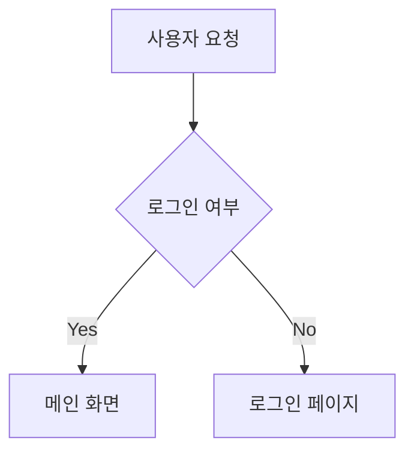

# Code Explainer

복잡한 코드를 비전공자도 이해할 수 있는 언어와 시각 자료로 설명합니다.

## 설명 가이드라인
1.  **비유(Metaphor)**: 기술 용어 대신 일상적인 소재(요리, 건축, 배달, 교통 등)를 사용하여 설명합니다.
2.  **시각화(Visualization)**: 코드의 흐름이나 데이터 구조를 `mermaid` 다이어그램으로 표현합니다.
3.  **요약(Summary)**: 마지막에 핵심 내용을 3줄로 요약합니다. (한국어 존댓말 사용)

## 다이어그램 예시

